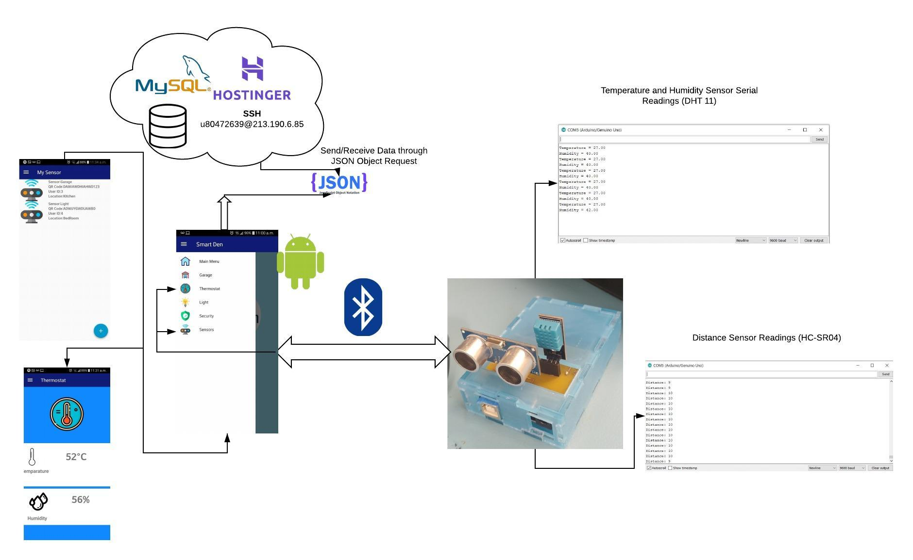
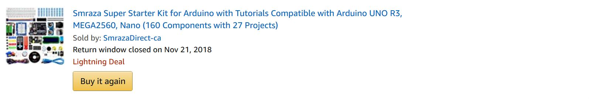
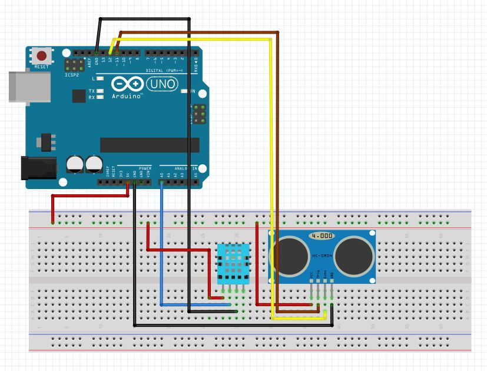
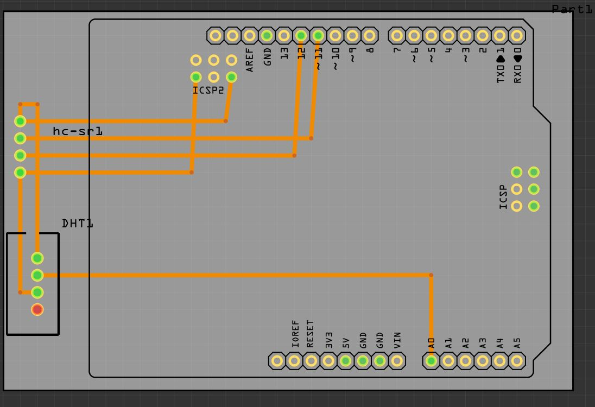
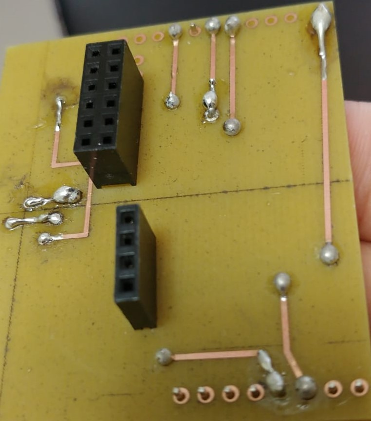
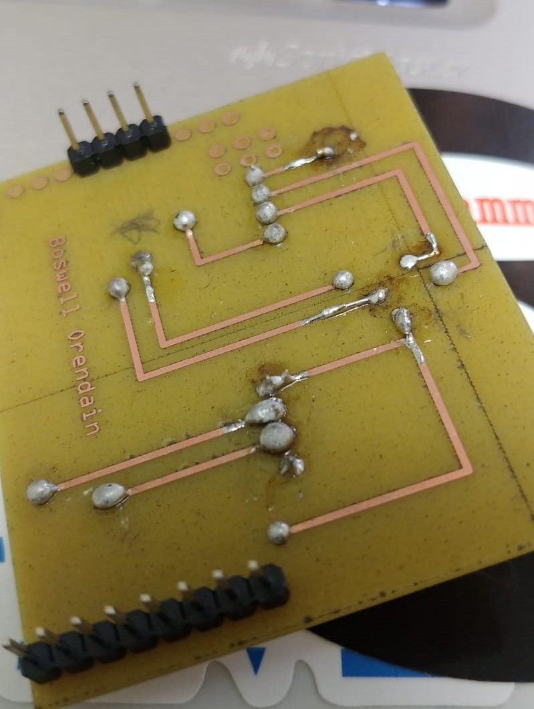
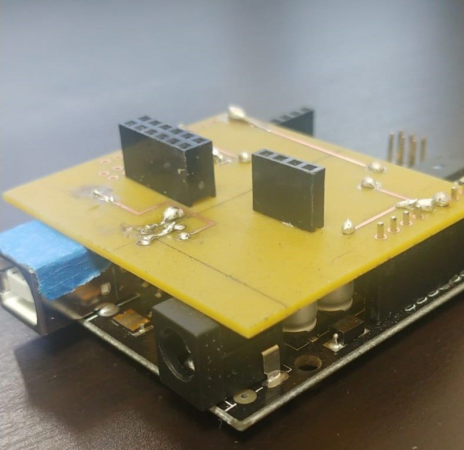

<h1>Introduction</h1> 
  
	
<h1>Bill of Materials/Budget</h1> 
	<!-- Bill of components here (individual or package?)-->

The materials came with a kit I had previously bought prior to this course.

  
 
If you want to buy the parts individually then:  

Modules 	  | Unit Price $(CAD) | Total Cost | Link |
------------- | -------------| -------------| -------------|
Arduino Uno R3 | 26.99 | | <a href="https://www.robotshop.com/ca/en/arduino-uno-r3-usb-microcontroller.html?gclid=CjwKCAiA8qLvBRAbEiwAE_ZzPcuDfbbajj1NVcvjjOGzziY92sE-PeEQv9CsHTed9Sek-rWy40W3QBoCD2sQAvD_BwE">BUY</a>
Temperate and Humidity Sensor (DHT-11)| 5.19| | <a href="https://www.robotshop.com/ca/en/dht11-temperature-humidity-sensor-module.html">BUY</a>
Distance Sensor (HC-SR04) | 6.55 | 38.73 |  <a href="https://www.robotshop.com/ca/en/hc-sr04-ultrasonic-range-finder-osepp.html">BUY</a>

			

<h1>Time Commitment</h1> 
	<!--Time expected to finis this?-->
	Task 	  | Time to Commit| 
------------- | -------------| 
Breadboard Connection + Testing Modules Readings with Arduino IDE | 1-2 hours |

<h1>Mechanical Assembly</h1> 

Follow the breadbord connection to test if each sensors are working properly.

 
  

<h1>PCB/Soldering</h1> 

Download the fritzing file here: <a href="https://github.com/boskyle/SmartDen/blob/master/documentation/CENG317_PCB_DESIGN.fzz">(Design File)</a> so you can get it printed.
  

<strong>PCB Design:</strong>

<strong>Top Layer:</strong>

<strong>Bottom Layer:</strong>

  

<strong>Attached to the Arduino Uno R3:</strong>

 

<h1>Power Up</h1> 

<h1>Unit Testing</h1> 

<h1>Production Testing </h1> 

