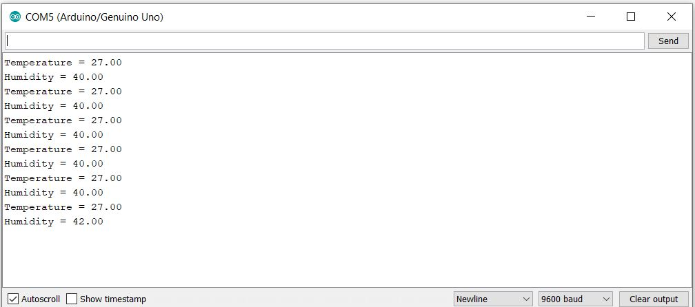

<h1>Introduction</h1> 
  
	
<h1>Bill of Materials/Budget</h1> 
	<!-- Bill of components here (individual or package?)-->

The materials came with a kit I had previously bought prior to this course.

  
 
If you want to buy the parts individually then:  

Modules 	  | Unit Price $(CAD) | Total Cost | Link |
------------- | -------------| -------------| -------------|
Arduino Uno R3 | 26.99 | | <a href="https://www.robotshop.com/ca/en/arduino-uno-r3-usb-microcontroller.html?gclid=CjwKCAiA8qLvBRAbEiwAE_ZzPcuDfbbajj1NVcvjjOGzziY92sE-PeEQv9CsHTed9Sek-rWy40W3QBoCD2sQAvD_BwE">BUY</a>
Temperate and Humidity Sensor (DHT-11)| 5.19| | <a href="https://www.robotshop.com/ca/en/dht11-temperature-humidity-sensor-module.html">BUY</a>
Distance Sensor (HC-SR04) | 6.55 | 38.73 |  <a href="https://www.robotshop.com/ca/en/hc-sr04-ultrasonic-range-finder-osepp.html">BUY</a>

			

<h1>Time Commitment</h1> 
	<!--Time expected to finis this?-->

Tasks | Time Expected to finish | 
--- | --- | 
Breadboard Connection + Testing Modules Readings with Arduino IDE | 1-2 hours |
PCB Soldering | 4-6 hours |
PCB Power Up | 30 minutes - 1 hour |
Arduino and PCB Case Made | 1 hour |

<h1>Mechanical Assembly</h1> 

Follow the breadbord connection to test if each sensors are working properly.

Use these source codes to the each hardware modules respectively and upload them to the arduino using Arduino IDE:
 

<b>Arduino IDE download</b>:<a href="https://www.arduino.cc/en/main/software"> CLICK HERE</a>  
<b>dht-11 (temp & humidity sensor) source code</b>:<a href="https://github.com/boskyle/SmartDen/blob/master/docs/ceng317_week8/dht_11_sketch.ino"> CODE</a>

<b>hc-sr04 (distance sensor) source code</b>:<a href="https://github.com/boskyle/SmartDen/blob/master/docs/ceng317_week8/dht_11_sketch.ino"> CODE</a>

 
  

Sensors readings connected with the breadboard should look like this:
 
<b>DHT-11 Readings: </b>

<b>HC-SR04 Readings: </b>

 

<h1>PCB/Soldering</h1> 

Download the fritzing file here: <a href="https://github.com/boskyle/SmartDen/blob/master/documentation/CENG317_PCB_DESIGN.fzz">(Design File)</a> so you can get it printed. 
<strong>PCB Software to open the file:</strong> <a href="https://fritzing.org/">CLICK_HERE</a> 
You will need 2x four pin headers so that your hardware modules can be inserted.  
- The pins of both headers would be sticking out to the bottom layer and the headers should be to the top layer. 
- See the picture below for reference.

  

<strong>PCB Design:</strong>

<strong>Top Layer:</strong> 

<strong>Bottom Layer:</strong>

  

<strong>Attached to the Arduino Uno R3:</strong>

 

<h1>Power Up</h1> 
 
 

<h1>Unit Testing</h1> 
 

Test each hardware units when connected to your PCB if they are working properly: 
 
<b>DHT-11 Readings: </b>

<b>HC-SR04 Readings: </b>
 

<h1>Production Testing </h1> 

<b>You can laser cut the same case as mine:</b> <a href="https://github.com/boskyle/SmartDen/blob/master/documentation/boswell2.cdr">case file</a> OR
 
<b>Make your own.</b> 
 

 Test hardware units with enclosure: 
 
 

<b>DHT-11 Readings: </b>

<b>HC-SR04 Readings: </b>
 