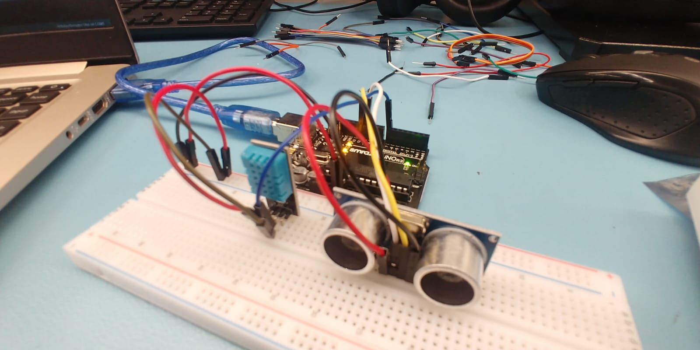
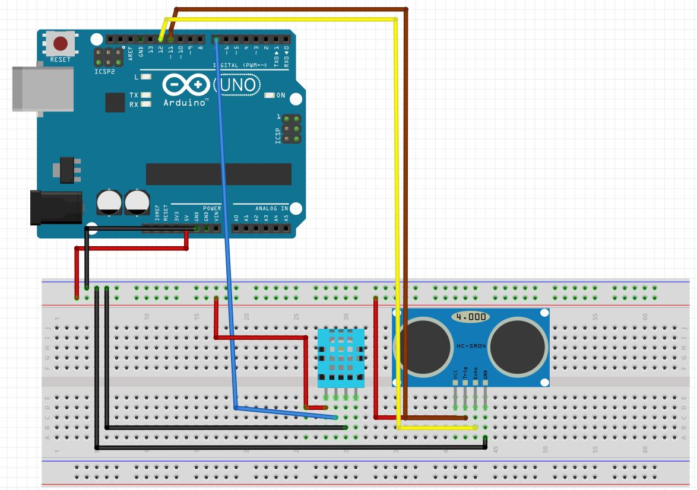
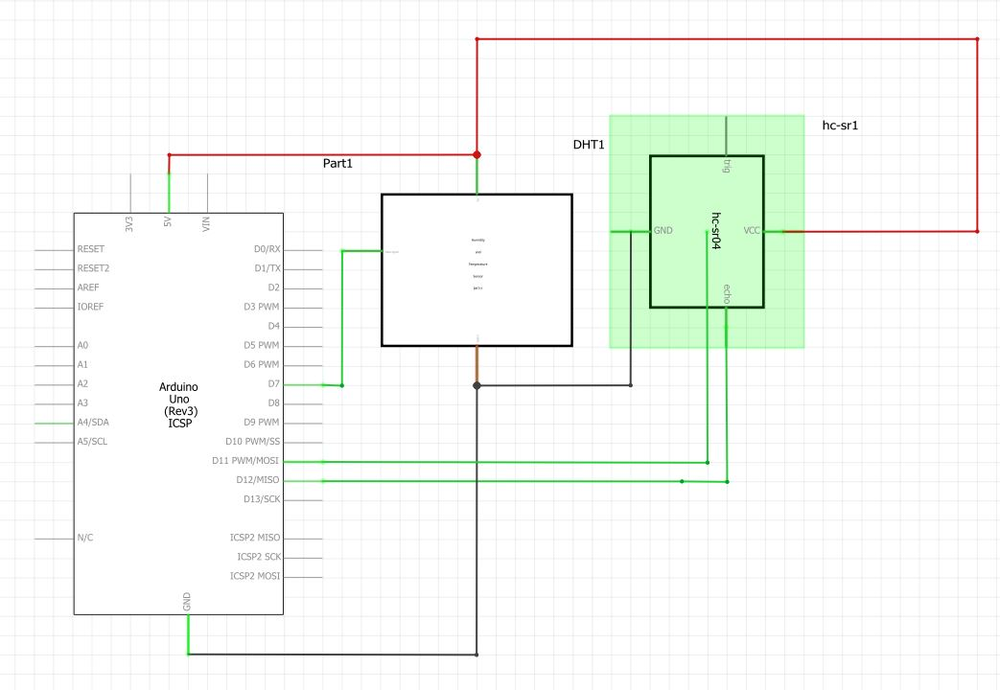

<html>
<h1> SmartDen Blog </h1>

<h3>October 29,2019</h3>

Made the breadboard connection of my hardware modules in class and displayed them in the Arduio IDE Serial Output.
 

DHT-11 (Temperature & Humidity Sensor): <a href="https://github.com/boskyle/SmartDen/blob/master/docs/ceng317_week8/dht_11_sketch.ino">Source Code</a>

 

HC-SR04 (Distance Sensor):<a href="https://github.com/boskyle/SmartDen/blob/master/docs/ceng317_week8/hc-sr04_sketch.ino">Source Code</a>
 
  

  

 <strong>DHT-11 Screenshot:</strong> 

  

 <strong>HC-SR04 Screenshot:</strong> 

  

<h3>October 22,2019 (Reading Week)</h3>

Loaded Anrduino IDE and tried the connection at home.
 

<h3 font color ="green">October 8,2019</h3>

Made Breadboard,PCB,Schematics Design <a href="https://github.com/boskyle/SmartDen/blob/master/documentation/CENG317_PCB_DESIGN.fzz">(Design File) </a>for the following hardware modules: 
	Arduino Uno R3 
	Temperature and Humidity Sensor (DHT-11) 
	Ultrasonic Distance Sensor (HC-SR04) 
	
	 
	 
	 

<h3 font color ="green">October 8,2019</h3>

Safety Discussion in class. How to use equipments safely and properly.

<h3 font color ="green">October 1,2019</h3>

Proof of purchase of my modules: The modules: Arduino Uno R3,Ultrasonic distance sensor(HC-SR04) and the Temperature and Humidity Sensor (DHT-11) are inside the kit purchased. 

 
<a href ="https://www.amazon.ca/gp/product/B06XXYVWVJ/ref=ppx_yo_dt_b_asin_image_o02_s00?ie=UTF8&psc=1">KIT</a>

<h3 font color ="green">September 24,2019</h3>

Decided on what each project members will work on and the modules they have selected.
 Sam Fatuga: RGB Led and has chosen the stm32 microcontroller board for demonstration.
 Boswell Orendain: Ultrasonic distance sensor and Temperate and Humidity Sensor and has chosen the arduino uno r3 microcontroller board.
 Hoang Phuc(Bobby) Quad Half H-Bride motor driver and has chosen to work on the raspberry pi.

  

<h3 font color="green">September 17,2019</h3>

Discussing amongst project members which hardware modules we should pick/work on.
 

<h3 font color="green">September 10,2019</h3>

Received hardware modules we should focus on and space the project is going to be built on from hardware professor (Kristian Medri) & partner company "Makerkids" CEO (Jennifer Turliuk). Discussed with software professor(Haki Sharifi) the functionalities of the mobile application based on our target audience and hardware modules given. Created a project repository: <a href="https://github.com/boskyle/SmartDen">SmartDen.</a>
  
 

<h3 font color="green">September 3,2019</h3>

Selected our project. Partnered with company "MakerKids".
 

</html>
